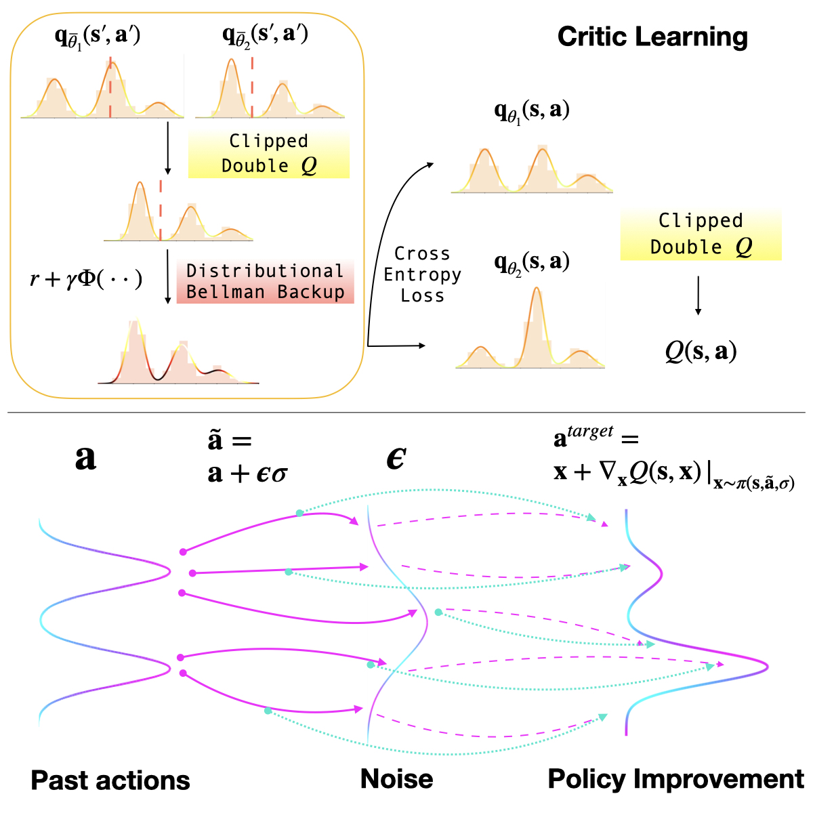

# D2 Actor Critic: Diffusion Actor Meets Distributional Critic

### Short Summary of D2AC:

A combination of distributional clipped double Q-function + denoising diffusion action-value gradients results in SOTA model-free RL.

This repo contains an implementation of the model-free RL method `D2AC`.

For dense reward experiments, go to folder `dense_rewards/`.

For sparse reward experiments, go to folder `sparse_rewards/`.

Note that those two sets of experiments require different conda environments because of compatibility issues.